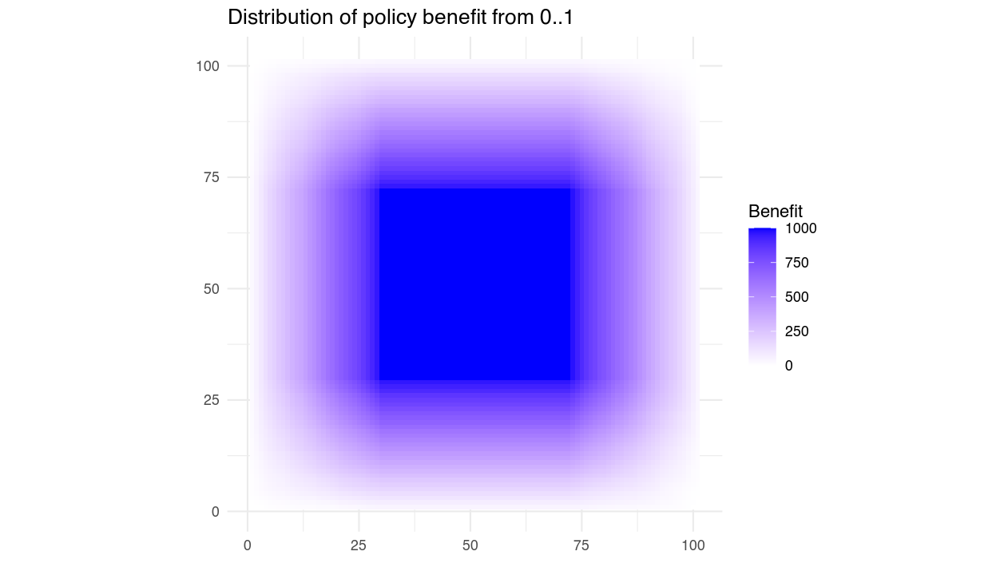
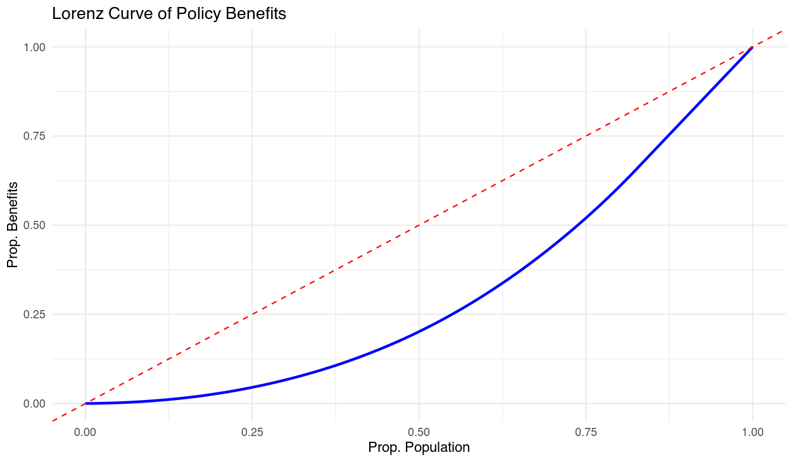

# Majoritarian Simulation Project

## Description
This project simulates policy impacts on populations under various scenarios, including elite, random, and centralized (capture) policy distributions. It includes tools for:

- Generating population grids with policy impacts.
- Visualizing inequality using heatmaps, Lorenz curves, and Gini coefficients.
- Summarizing and exporting results for further analysis.

---

## Features
- Simulates three policy impact scenarios: `elite`, `random`, and `capture`.
- Generates Gini coefficients to measure inequality.
- Visualizes results with heatmaps, Lorenz curves, and policy coverage plots.
- Provides summary statistics and exports results for easy analysis.

---

## Installation

### Prerequisites
- R (version 4.0 or higher)
- Required R packages: `tidyverse`, `patchwork`

### Steps
1. Clone the repository:
   ```bash
   git clone https://github.com/your-username/majoritarian-simulation.git
   cd majoritarian-simulation
   ```
2. Install dependencies in R:
   ```R
   install.packages(c("tidyverse", "patchwork"))
   ```
3. Ensure the `R` directory contains all helper files and the `main.R` script is in the root directory.
4. Create an `output` directory in the root folder to store results and visualizations.

---

## Usage

### Run Simulations
1. Open `main.R` in RStudio or your preferred R environment.
2. Run the entire script to:
   - Generate policy impact simulations.
   - Visualize results.
   - Save Gini coefficients and visualizations to the `output` directory.

### Results Processing
1. The results (Gini coefficients) are stored in `output/gini_results.csv`.
2. Summary statistics and visualizations are automatically generated by `results.R`:
   - Gini summary: `output/gini_summary.csv`
   - Gini plot: `output/gini_plot.svg`

---

## Project Structure
```plaintext
.
├── main.R                # Main script to run simulations and generate results
├── R/                    # Directory for helper scripts
│   ├── helpers.R         # Utility functions
│   ├── simulation.R      # Functions to generate policy impact grids
│   ├── visualisation.R   # Visualization functions
│   ├── results.R         # Results processing and reporting
├── output/               # Directory to save results and visualizations
├── README.md             # Project documentation
```

---

## Example Output

### Heatmap
Heatmap showing the distribution of policy benefits:


### Lorenz Curve
Lorenz curve illustrating inequality:


### Gini Coefficient Summary
| Method     | Mean Gini | Median Gini | Min Gini | Max Gini |
|------------|-----------|-------------|----------|----------|
| Elite      | 0.45      | 0.44        | 0.30     | 0.60     |
| Random     | 0.10      | 0.09        | 0.05     | 0.15     |
| Capture    | 0.50      | 0.50        | 0.45     | 0.55     |

---

## Citation

If you use this repository in your research or publication, please cite it as follows:

**Bibtex**

@software{reidpath_majoritarian_simulation_2025,
  author = {Reidpath, Daniel D.},
  title = {Majoritarian Simulation Project},
  year = {2025},
  version = {1.0},
  url = {https://github.com/your-username/majoritarian-simulation},
  note = {Simulation code for studying majoritarian policy impacts under various scenarios.}
}

**APA**

Reidpath, D. D. (2025). Majoritarian Simulation Project (Version 1.0) [Computer software]. GitHub. https://github.com/your-username/majoritarian-simulation


---

## License
This project and all code is licensed under the GNU General Public License v3.0. See `LICENSE` for more details.

---

## Contact
- Author: Daniel D. Reidpath
- GitHub: [dreidpath](https://github.com/dreidpath)

